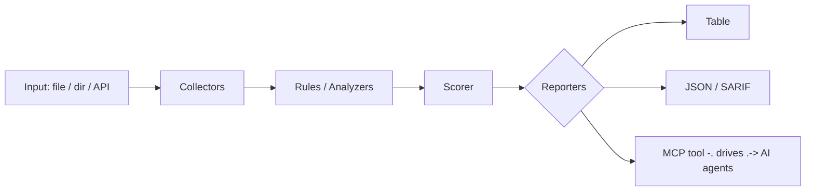

<a name="top"></a>
<div align="center">


# NARRATIVEDIFF

### News bias & framing diff across 50+ outlets per event


[](#install--every-way-every-platform) [](https://github.com/cognis-digital/narrativediff/actions) [](LICENSE) [](https://github.com/cognis-digital)

*Information Integrity — provenance, synthetic-media, and narrative analysis.*

</div>

```bash
pip install "git+https://github.com/cognis-digital/narrativediff.git"
narrativediff scan .            # → prioritized findings in seconds
```

<!-- cognis:layman:start -->
## What is this?

narrativediff compares how different news outlets cover the same event, showing you which ones use favorable or alarming language, which ones leave out details that others mention, and how far apart the coverage really is. You give it a list of articles about one event and it produces a side-by-side breakdown: bias scores, charged words, hedging, sensationalism, and the facts each outlet chose to omit. It is a tool for journalists, researchers, and anyone who wants to see through spin and understand how the same story gets told very differently depending on where you read it.
<!-- cognis:layman:end -->

## Contents

- [Why narrativediff?](#why) · [Features](#features) · [Quick start](#quick-start) · [Example](#example) · [Architecture](#architecture) · [AI stack](#ai-stack) · [How it compares](#how-it-compares) · [Integrations](#integrations) · [Install anywhere](#install-anywhere) · [Related](#related) · [Contributing](#contributing)

<a name="why"></a>
## Why narrativediff?

News bias & framing diff across 50+ outlets per event — without standing up heavyweight infrastructure.

`narrativediff` is single-purpose, scriptable, and self-hostable: point it at a target, get prioritized results in the format your workflow already speaks (table · JSON · SARIF), gate CI on it, and let agents drive it over MCP.

<div align="right"><a href="#top">↑ back to top</a></div>

<a name="features"></a>
## Features

- ✅ Analyze Event
- ✅ Load Corpus
- ✅ Result To Dict
- ✅ Runs on Linux/macOS/Windows · Docker · devcontainer
- ✅ Ports in Python, JavaScript, Go, and Rust (`ports/`)

<div align="right"><a href="#top">↑ back to top</a></div>

<a name="quick-start"></a>
<!-- cognis:domains:start -->
## Domains

**Primary domain:** Intelligence & OSINT  ·  **JTF MERIDIAN division:** NULLBYTE · BLACK CELL

**Topics:** `cognis` `osint` `intelligence` `recon`

Part of the **Cognis Neural Suite** — 300+ source-available tools organized across 12 domains under the JTF MERIDIAN command structure. See the [suite on GitHub](https://github.com/cognis-digital) and [jtf-meridian](https://github.com/cognis-digital/jtf-meridian) for how the pieces fit together.
<!-- cognis:domains:end -->

<!-- cognis:install:start -->
## Install

`narrativediff` is source-available (not published to PyPI) — every method below installs
straight from GitHub. Pick whichever you prefer; the one-line scripts auto-detect
the best tool available on your machine.

**One-liner (Linux / macOS):**
```sh
curl -fsSL https://raw.githubusercontent.com/cognis-digital/narrativediff/HEAD/install.sh | sh
```

**One-liner (Windows PowerShell):**
```powershell
irm https://raw.githubusercontent.com/cognis-digital/narrativediff/HEAD/install.ps1 | iex
```

**Or install manually — any one of:**
```sh
pipx install "git+https://github.com/cognis-digital/narrativediff.git"     # isolated (recommended)
uv tool install "git+https://github.com/cognis-digital/narrativediff.git"  # uv
pip install "git+https://github.com/cognis-digital/narrativediff.git"      # pip
```

**From source:**
```sh
git clone https://github.com/cognis-digital/narrativediff.git
cd narrativediff && pip install .
```

Then run:
```sh
narrativediff --help
```
<!-- cognis:install:end -->

## Quick start

```bash
pip install "git+https://github.com/cognis-digital/narrativediff.git"
narrativediff --version
narrativediff scan .                       # scan current project
narrativediff scan . --format json         # machine-readable
narrativediff scan . --fail-on high        # CI gate (non-zero exit)
```

<div align="right"><a href="#top">↑ back to top</a></div>

<a name="example"></a>
## Example

```text
$ narrativediff scan .
  [HIGH    ] NAR-001  example finding             (./src/app.py)
  [MEDIUM  ] NAR-002  another signal              (./config.yaml)

  2 findings · risk score 5 · 38ms
```

<div align="right"><a href="#top">↑ back to top</a></div>

<a name="architecture"></a>
## Architecture



<div align="right"><a href="#top">↑ back to top</a></div>

<a name="ai-stack"></a>
## Use it from any AI stack

`narrativediff` is interoperable with every popular way of using AI:

- **MCP server** — `narrativediff mcp` (Claude Desktop, Cursor, Cognis.Studio, [uncensored-fleet](https://github.com/cognis-digital/uncensored-fleet))
- **OpenAI-compatible / JSON** — pipe `narrativediff scan . --format json` into any agent or LLM
- **LangChain · CrewAI · AutoGen · LlamaIndex** — wrap the CLI/JSON as a tool in one line
- **CI / scripts** — exit codes + SARIF for non-AI pipelines

<div align="right"><a href="#top">↑ back to top</a></div>

<a name="how-it-compares"></a>
## How it compares

| | **Cognis narrativediff** | Media-Bias-Group |
|---|:---:|:---:|
| Self-hostable, no account | ✅ | varies |
| Single command, zero config | ✅ | ⚠️ |
| JSON + SARIF for CI | ✅ | varies |
| MCP-native (AI agents) | ✅ | ❌ |
| Polyglot ports (JS/Go/Rust) | ✅ | ❌ |
| Open license | ✅ COCL | varies |

*Built in the spirit of **Media-Bias-Group/MBIB**, re-framed the Cognis way. Missing a credit? Open a PR.*

<div align="right"><a href="#top">↑ back to top</a></div>

<a name="integrations"></a>
## Integrations

Pipes into your stack: **SARIF** for code-scanning, **JSON** for anything, an **MCP server** (`narrativediff mcp`) for AI agents, and a webhook forwarder for SIEM/Slack/Jira. See [`docs/INTEGRATIONS.md`](docs/INTEGRATIONS.md).

<div align="right"><a href="#top">↑ back to top</a></div>

<a name="install-anywhere"></a>
## Install — every way, every platform

```bash
pip install "git+https://github.com/cognis-digital/narrativediff.git"    # pip (works today)
pipx install "git+https://github.com/cognis-digital/narrativediff.git"   # isolated CLI
uv tool install "git+https://github.com/cognis-digital/narrativediff.git" # uv
pip install cognis-narrativediff                                          # PyPI (when published)
docker run --rm ghcr.io/cognis-digital/narrativediff:latest --help        # Docker
brew install cognis-digital/tap/narrativediff                             # Homebrew tap
curl -fsSL https://raw.githubusercontent.com/cognis-digital/narrativediff/main/install.sh | sh
```

| Linux | macOS | Windows | Docker | Cloud |
|---|---|---|---|---|
| `scripts/setup-linux.sh` | `scripts/setup-macos.sh` | `scripts/setup-windows.ps1` | `docker run ghcr.io/cognis-digital/narrativediff` | [DEPLOY.md](docs/DEPLOY.md) (AWS/Azure/GCP/k8s) |

<div align="right"><a href="#top">↑ back to top</a></div>

<a name="related"></a>
<a name="verification"></a>
## Verification

[](AUDIT.md)

Every push is verified end-to-end. Latest audit (2026-06-13):

```text
tests        : 11 passed, 0 failed, 0 errored
compile      : all modules parse
cli          : C:\Python314\python.exe: No module named https
package      : https
```

<details><summary>CLI surface (<code>--help</code>)</summary>

```text
C:\Python314\python.exe: No module named https
```
</details>

Full machine-readable results: [`AUDIT.md`](AUDIT.md) · regenerate with `python -m https --help` + `pytest -q`.

<div align="right"><a href="#top">↑ back to top</a></div>


## Related Cognis tools

- [`claimtrace`](https://github.com/cognis-digital/claimtrace) — Misinformation provenance tracer — earliest-known appearance graph
- [`deepcheck`](https://github.com/cognis-digital/deepcheck) — Lightweight synthetic-media detector with C2PA validation
- [`electionlens`](https://github.com/cognis-digital/electionlens) — Influence-operations pattern monitor for election periods

**Explore the suite →** [🗂️ all 170+ tools](https://github.com/cognis-digital/cognis-neural-suite) · [⭐ awesome-cognis](https://github.com/cognis-digital/awesome-cognis) · [🔗 cognis-sources](https://github.com/cognis-digital/cognis-sources) · [🤖 uncensored-fleet](https://github.com/cognis-digital/uncensored-fleet) · [🧠 engram](https://github.com/cognis-digital/engram)

<div align="right"><a href="#top">↑ back to top</a></div>

<a name="contributing"></a>
## Contributing

PRs, new rules, and demo scenarios are welcome under the collaboration-pull model — see [CONTRIBUTING.md](CONTRIBUTING.md) and [SECURITY.md](SECURITY.md).

> ### ⭐ If `narrativediff` saved you time, **star it** — it genuinely helps others find it.

## License

Source-available under the **Cognis Open Collaboration License (COCL) v1.0** — free for personal, internal-evaluation, research, and educational use; **commercial / production use requires a license** (licensing@cognis.digital). See [LICENSE](LICENSE).

---

<div align="center"><sub><b><a href="https://cognis.digital">Cognis Digital</a></b> · one of 170+ tools in the <a href="https://github.com/cognis-digital/cognis-neural-suite">Cognis Neural Suite</a> · <i>Making Tomorrow Better Today</i></sub></div>
